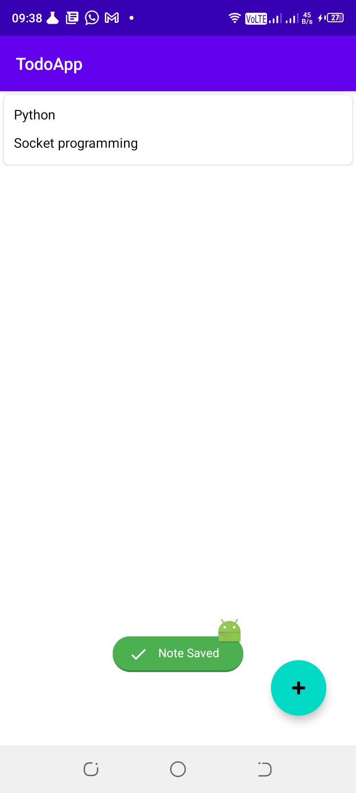
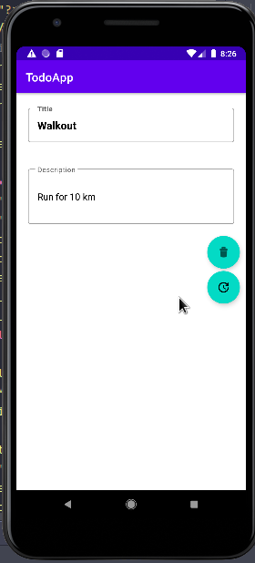
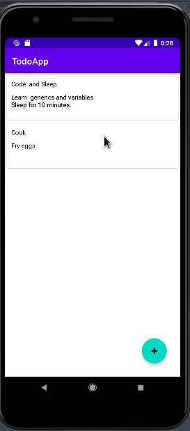

## TodoApp
- An android app to demonstrate using Room Jetpack component and make a simple note application
- It is build using MVVM architecture pattern and Jetpack components

 
Minimum Api supported: 21 [Supports Over 87% Devices](https://developer.android.com/about/dashboards)
Build System: [Gradle](https://gradle.org/)
 

## Table of Contents
- [AbouttheApp](#abouttheapp)
- [Prerequisite](#prerequisite)
- [Architecture](#architecture)
- [Introduction](#introduction)
- [Libraries](#libraries)
- [Screenshots](#screenshots)
 

## Prerequisite
- To run these application your need the following tools
* Android Studio
* Clone the repo here [clone](https://github.com/Alex-mumo/TodoApp.git) or [fork]()

 
## Architecture
- The app is build with MVVM architecture to allow separation of concerns to allow data not to be destroyed over configuration changes.

## Introduction
- Room provides abstraction layer over SQLite to allow fluent database access
- Room has three main components:
*  Entity - represents tables in the database. Annotated with @Entity
*  Data Access Objects(Dao) - A mapping of SQL queries to functions. Annotated with @Dao
*  Room Database - Acts as the main access point to the underlying SQLite database.
 
   
## Libraries
* [Navigation Components](https://developer.android.com/guide/navigation/navigation-getting-started) - provides simple navigation across the app 
* [Hilt](https://developer.android.com/training/dependency-injection/hilt-android) - Hilt is a dependency injection library for Android that reduces the boilerplate of doing manual dependency injection in your project.
* [ViewModel](https://developer.android.com/topic/libraries/architecture/viewmodel) - Manage UI related data in a lifecycle concious way
* [View Binding](https://developer.android.com/topic/libraries/data-binding) - Jetpack library for binding with views
* [kotlinx.coroutines](https://github.com/Kotlin/kotlinx.coroutines) - Library support for coroutines.
* [Material Design](https://material.io/develop/android/docs/getting-started/) - Build awesome beautiful UIs.
* [LiveData](https://developer.android.com/topic/libraries/architecture/livedata) - Lifecycle aware.
* [Timber](https://jakewharton.github.io/timber/docs/5.x/) - Logger with small and extensible API which provides on top normal Android normal Log class

 
## <h4>hScreenshots</h4>
<table>
<thead>
<tr>
<th align="center">Save Note</th>
<th align="center">Update Note</th>
<th align="center">Notes</th>
</tr>
</thead>
<tbody>
<tr>
<td></td>
<td></td>
<td></td>
</tr>
</tbody>
</table>

